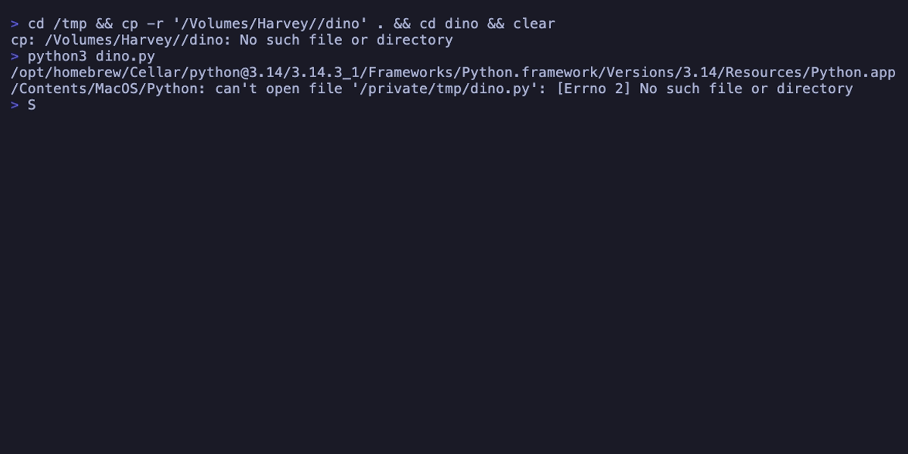

<p align="center">
  
  
  
  
</p>

<h1 align="center">🦕 dino</h1>

<p align="center">
  <strong>The Chrome Dinosaur Game — reborn in your terminal.</strong>
</p>

<p align="center">
  
</p>

<p align="center">
  Jump over cacti. Duck under pterodactyls. Chase your high score.<br/>
  Pure Python. Zero dependencies. Just <code>pip install dino-run</code> and play.
</p>

<p align="center">
  <a href="#-features">Features</a> •
  <a href="#-install">Install</a> •
  <a href="#-controls">Controls</a> •
  <a href="#-how-it-works">How it works</a> •
  <a href="#-contributing">Contributing</a>
</p>

---

## ✨ Features

- 🦕 **Classic T-Rex gameplay** — Jump, duck, and dodge obstacles just like the Chrome offline game
- 🌵 **Multiple obstacle types** — Small cacti, large cacti, double cacti, and flying pterodactyls
- 🌗 **Day/night cycle** — The world transitions between day and night every 700 points
- ⚡ **Progressive difficulty** — Speed increases over time, obstacles spawn more frequently
- ☁️ **Parallax effects** — Clouds scroll at different speeds for visual depth
- ⭐ **Starfield** — Stars appear during nighttime with smooth fade transitions
- 🏆 **High score tracking** — Your best score persists during the session
- 🎨 **Animated sprites** — Running, jumping, ducking, and death animations via ASCII art
- 📊 **Speed indicator** — Watch your speed climb in real time
- 💯 **Milestone flash** — Score blinks every 100 points, just like the original
- 🪶 **Zero dependencies** — Uses only Python standard library (`curses`)

## 📦 Install

```bash
# Install from PyPI (coming soon)
pip install dino-run

# Or clone and play immediately
git clone https://github.com/nadonghuang/dino.git
cd dino
python3 dino.py
```

### Requirements

- Python 3.8+
- Terminal with Unicode support
- Terminal size ≥ 50×16 (most terminals qualify)

## 🎮 Controls

| Key | Action |
|-----|--------|
| `SPACE` / `↑` | Jump |
| `↓` | Duck |
| `Q` / `ESC` | Quit |
| Any key | Restart (after game over) |

## 🚀 Usage

```bash
# Quick play — no install needed
python3 dino.py

# Via pip install
dino-run

# Or make it executable
chmod +x dino.py
./dino.py
```

## 🔧 How It Works

```
dino/
├── dino.py           # Complete game — single file, ~550 lines
├── bin/dino          # CLI entry point
├── pyproject.toml    # Package config
├── demo.gif          # Gameplay demo
├── LICENSE           # MIT
└── README.md         # You are here
```

The entire game lives in **one Python file** using only the standard library:

| Component | Implementation |
|-----------|---------------|
| **Rendering** | `curses` — Terminal colors, non-blocking input, frame control |
| **Physics** | Gravity-based jump arcs with velocity tracking |
| **Sprites** | Multi-frame ASCII art with collision hitbox detection |
| **World gen** | Procedural obstacle spawning with difficulty scaling |
| **Parallax** | Clouds, ground, and stars at different scroll speeds |

### Game Mechanics

- **Jump**: Velocity-based arc — gravity `0.6`, jump force `2.8`
- **Duck**: Reduces hitbox height to slide under pterodactyls
- **Speed**: Starts at 8 chars/sec, +0.002/frame, caps at 25
- **Pterodactyls**: Appear after score 300, fly at varying heights
- **Collision**: Shrunk hitboxes with 1-char padding for forgiving gameplay
- **Day/Night**: Toggles every 700 points with smooth color transitions

## 🤝 Contributing

Ideas welcome:

- 🔊 Sound effects (terminal bell on jump)
- 🏗️ New obstacle types
- 📏 Difficulty presets (easy / medium / hard)
- 🎯 Obstacle pattern generator
- 🎨 Color theme customization

Fork → Branch → PR. Keep it zero-dep.

## 📄 License

MIT — see [LICENSE](LICENSE) for details.

---

<p align="center">
  Made with 🦕 by <a href="https://github.com/nadonghuang">nadonghuang</a>
  <br/>
  <sub>If you survived past 1000, you're a legend. ⭐ Star this repo!</sub>
</p>
